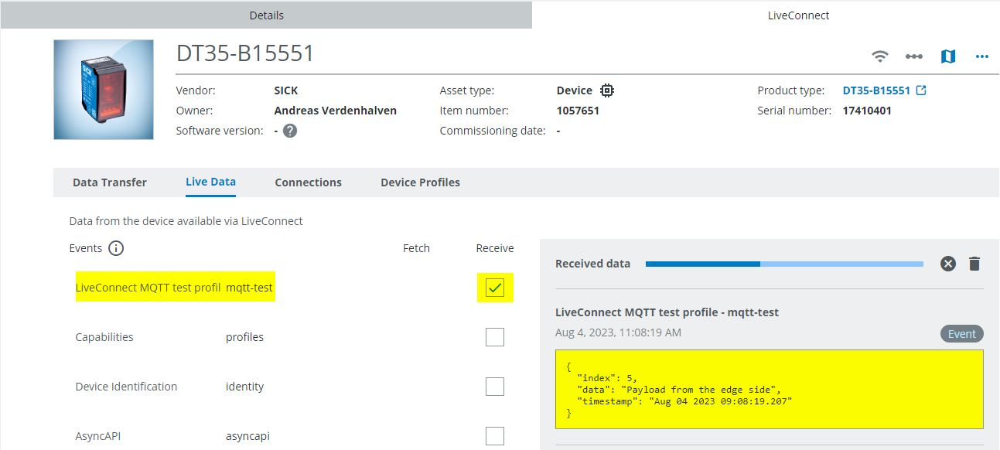
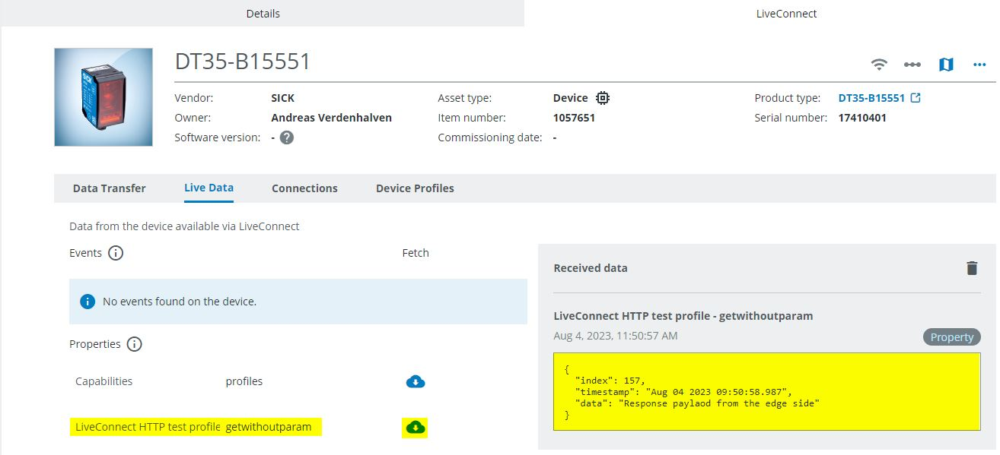

# CSK_Template_LiveConnectDemo
CSK template to show how to exchange data with a digital device (digital twin) configured in the SICK AssetHub using SICK LiveConnect.

## Pairing
Before data can be exchanged, the physical gateway device must first be paired with the digital twin in the SICK AssetHub. Please do the following step by step:

**SICK AssetHub**

 1. Open the digital service [SICK AssetHub](https://assethub.cloud.sick.com)
-- In order to use the SICK AssetHub, you need to subscribe it via the [SICK Digital Service Catalog](https://cloud.sick.com/subscription)
-- You also need a subscription for SICK LiveConnect
 2. Create a digital twin of your gateway device using the part-/ and serial number of the physical device.
 3. Start the pairing process to pair the digital twin with a physical device via SICK LiveConnect.

 4. Please copy the pairing code.

**SICK LiveConnect Client App**

 5. Open the UI of the SICK LiveConnect Client app by entering the IP address of your device in the browser.
 7. If you need to configure IP addresses of your device, please open the app "CSK_Module_DeviceNetworkConfig".
 8. Open the app "CSK_Module_DateTime" to setup the system time of your gateway device.
--  As an NTP server, you can use a server of your choice or the NTP server provided by SICK (35.157.9.76)
-- The system time must be synchronized, otherwise a secure connection to the cloud cannot be established.
 9. Open the app "CSK_Module_LiveConnect".
 10. Check if the System clock status is "configured". Enter the pairing code generated by the AssetHub in order to pair this device with LiveConnect.

 12. The "connection status" should then switched to "Online".
 13. Now the device is paired and ready to exchange data with the cloud.
 

## Profiles
The data that is exchanged between the device and the AssetHub is defined via profiles. It is possible to bind one or more profiles to a device.
There are two types of profiles that can be used:

### MQTT profiles
- Use-Case: The device automatically push data into the cloud.
- Profile-Type: [AsyncAPI]
- Profile-Editor: [AsyncAPI Studio]

#### Sequence (sample)


### HTTP profiles
- Use-Case: An HTTP request sent from the cloud side is transmitted to the device. The device generates a response that corresponds to the data profile and sends it back to the cloud (data poll mechanism).
- Profile-Type: [OpenAPI]
- Profile-Editor: [Swagger Editor]

#### Sequence (sample)


## How to Run
Please checkout the project and run the Powershell script "createProject.ps1". The script creates a project folder that can be opened with AppStudio. New versions of the dependent modules can also be loaded into the project via the script.

### Demo application
The CSK_Template_LiveConnectDemo app used generated dummy data and connects it to digital device (SICK DT35) in the SICK AssetHub. To show both LiveConnect ways, a HTTP, as well as a MQTT profile is added to the same device.

#### MQTTDemo.lua
In this demo script, the profile "profileMQTTTest.yaml" is added to the device. In the implementation part, the generated dummy data is sent to the AssetHub automatically every 5 seconds.

On the AssetHub side, the data can be viewed and forwarded to a web application.


#### HTTPDemo.lua
In this demo script, the profile "profileHTTPTest.yaml" is added to the device. In addition, a callback function is added (httpCallback), which is called as soon as a request is received from the cloud side. The response data is structured as defined in the profile.

On the AssetHub side, the data can send a GET request to the endpoint. The response telegram can be viewed.



## Information
### Tested on
|Device|Firmware|
|--|--|
|SIM1012|V2.3.0|
|SIM1000fx|V1.7.2|
|TDCE-E|L4M 2023.2 (with app Engine V2.0.0)|

### Dependencies
Following CSK modules are used for this application via Git subtrees and should NOT be further developed within this repository (see [contribution guideline](https://github.com/SICKAppSpaceCodingStarterKit/.github/blob/main/Contribution_Guideline.md) of this GitHub organization):  

|Module|Version|Remark
|--|--|--|
|CSK_Module_LiveConenct|[V3.0.0](https://github.com/SICKAppSpaceCodingStarterKit/CSK_Module_LiveConnect)|This module provides the LiveConnect functionality
|CSK_1stModule_Logger|[V4.0.0](https://github.com/SICKAppSpaceCodingStarterKit/CSK_1stModule_Logger/releases/tag/v4.0.0)|Optional
|CSK_Module_DateTime|[V3.0.0](https://github.com/SICKAppSpaceCodingStarterKit/CSK_Module_DateTime/releases/tag/v3.0.0)|This module is not required using a TDC-E as gateway device
|CSK_Module_DeviceNetworkConfig|[V2.0.0](https://github.com/SICKAppSpaceCodingStarterKit/CSK_Module_DeviceNetworkConfig/releases/tag/v2.0.0)|This module is not required using a TDC-E as gateway device
|CSK_Module_PersistentData|[V4.0.0](https://github.com/SICKAppSpaceCodingStarterKit/CSK_Module_PersistentData/releases/tag/v4.0.0)|Necessary to persist data

## Tests
Optionally, a test script can be added to the project (UnitTests_LiveConnect), that tests some aspects of the app.

This unit test establishes a paring between the device and the digital twin in the AssetHub. The corresponding asset must already exist in the AssetHub. The pairing token is given as the parameter "token" when the test is started. A peer device is automatically added to the gateway device. An HTTP and an MQTT profile are added to both devices (gateway and peer device).

The unit tests can be started via an HTTP REST call (POST) or with a standard crown call.

```Json
Body:
{
  "data": {
    "token": "" // Empty string = Use an already existing pairing
  }
}
```

>**Remark**
> The test classes are executed in alphabetical order. The test cases do not really have a "unit test" character, but are a mixture of unit tests and integration tests.

## Topics
Coding Starter Kit, CSK, Module, SICK-AppSpace, LiveConnect, AssetHub, Cloud

[AsyncAPI]: <https://www.asyncapi.com>
[AsyncAPI Studio]: <https://studio.asyncapi.com>
[OpenAPI]: <https://www.openapis.org>
[Swagger Editor]: <https://editor.swagger.io>